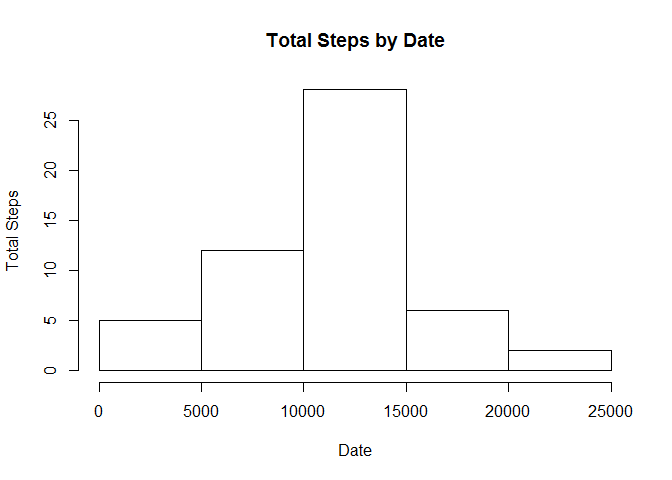
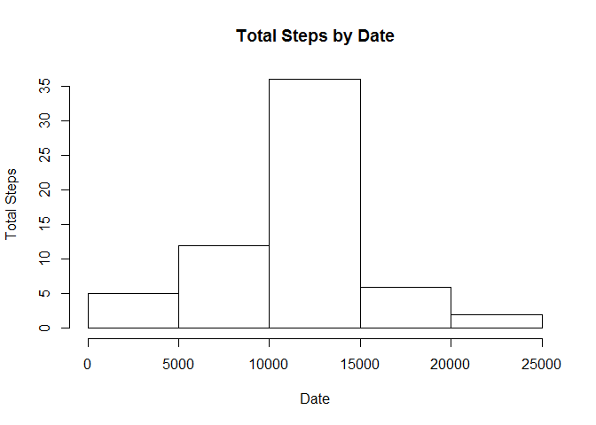
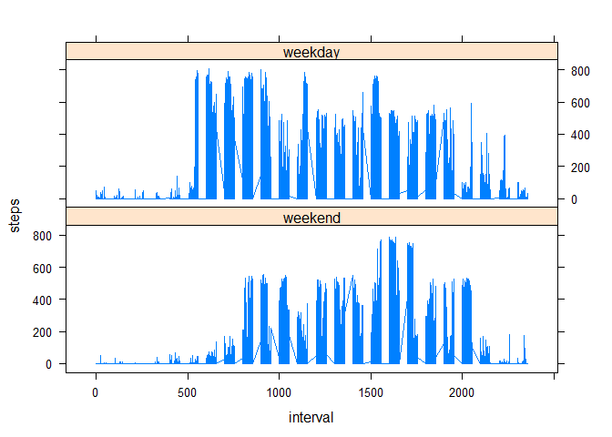

# Reproducible Research - Assignment 1

Report on data from activity monitoring devices

Dataset: https://d396qusza40orc.cloudfront.net/repdata%2Fdata%2Factivity.zip
Data contains total steps per 5 second period per day.  17568 observations.

For this analysis, we will use the following libraries:

```r
library(timeDate)
library(lattice)
library(ggplot2)
```

### Read in the activity data

```r
steps <- read.csv("activity.csv")
```

### Histogram of total steps by date

```r
sum_by_date <- aggregate(steps ~ date, steps, sum)
hist(sum_by_date$steps, main="Total Steps by Date", xlab="Date", ylab="Total Steps")
```

<!-- -->

### Mean steps by date

```r
mean_daily_steps <- mean(sum_by_date$steps, na.rm=TRUE)
mean_daily_steps
```

```
## [1] 10766.19
```

### Median steps by date

```r
median_daily_steps <- median(sum_by_date$steps, na.rm=TRUE)
median_daily_steps
```

```
## [1] 10765
```

### Average steps across 5-second intervals

```r
avg_per_interval <- aggregate(steps ~ interval, steps, mean)
avg_plot <- ggplot( data = avg_per_interval, aes( interval, steps )) + geom_line() 
print(avg_plot)
```

<!-- -->

### 5-second interval with maximum number of average steps

```r
max_interval <- avg_per_interval$interval[which.max(avg_per_interval$steps)]
max_interval
```

```
## [1] 835
```

### Number of rows with missing data

```r
num_missing_rows <- sum(!complete.cases(steps)) 
num_missing_rows
```

```
## [1] 2304
```

### Add missing data - use average steps for interval

```r
new_steps <- merge(steps, avg_per_interval, by = "interval")
new_steps$steps.x[is.na(new_steps$steps.x)] <- as.character(new_steps$steps.y[is.na(new_steps$steps.x)])
new_steps$steps <- as.numeric(new_steps$steps.x)
```

### Total steps by date (with added data)

```r
new_sum_by_date <- aggregate(steps ~ date, new_steps, sum)
hist(new_sum_by_date$steps, main="Total Steps by Date", xlab="Date", ylab="Total Steps")
```

<!-- -->

### Mean steps by date (with added data)

```r
new_mean_daily_steps <- mean(new_sum_by_date$steps, na.rm=TRUE)
new_mean_daily_steps
```

```
## [1] 10766.19
```

### Median steps by date (with added data)

```r
new_median_daily_steps <- median(new_sum_by_date$steps, na.rm=TRUE)
new_median_daily_steps
```

```
## [1] 10766.19
```


### Difference in steps between weekend days and weekdays
Steps begin earlier on weekdays and most intervals contain more steps on weekdays

```r
new_steps$dayType <- factor(isWeekday(new_steps$date, wday=1:5), levels=c(FALSE,TRUE), labels=c('weekend','weekday'))
panel_plot <- xyplot(steps ~ interval|factor(dayType), data = new_steps, type = "l", xlab = "interval", ylab = "steps", layout=c(1,2))
print(panel_plot)
```

<!-- -->
